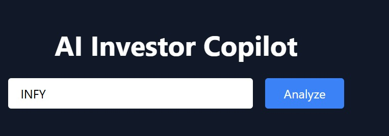
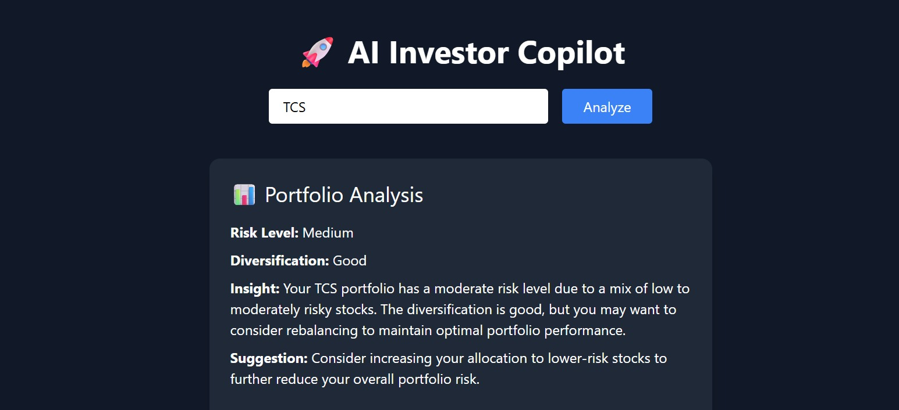
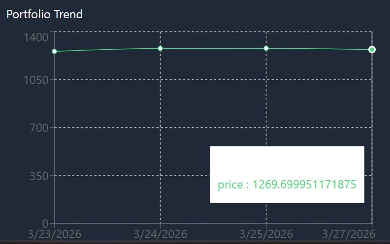

#  AI Investor Copilot

<p align="center">
  <b>GenAI-powered Portfolio Intelligence System for Smarter Investing 📊</b><br/>
  Transforming guess-based investing into data-driven decision making.
</p>

---

## Problem Statement

Retail investors today rely on fragmented sources like news, social media tips, and intuition to make financial decisions. This leads to:

* ❌ Poor diversification
* ❌ High risk exposure
* ❌ Lack of actionable insights
* ❌ Time-consuming analysis

There is a need for a system that can **analyze portfolios intelligently and provide clear recommendations**.

---

##  Solution Overview

**AI Investor Copilot** is a GenAI-powered system that:

* Analyzes entire portfolios
* Detects risk and diversification gaps
* Generates explainable AI insights
* Uses real-time stock data
* Provides actionable recommendations

> This is not just a chatbot — it's a **Decision Intelligence Engine**

---

## Key Features

* **Portfolio Analysis**
  Understand risk level and diversification quality

* **AI-Powered Insights**
  Context-aware recommendations using LLM

* **Real-Time Stock Data**
  Integrated with Yahoo Finance API

* **Visual Trend Analysis**
  Interactive charts for better understanding

* **Actionable Suggestions**
  Clear next steps for improving portfolio

---

## System Architecture

```text
User Input (Portfolio)
        ↓
React Frontend (UI)
        ↓
Node.js Backend (API)
        ↓
 ┌───────────────────────────────┐
 │   Yahoo Finance API           │ → Real-time stock data
 │   Groq LLM (LLaMA 3.1)        │ → AI analysis
 └───────────────────────────────┘
        ↓
Processed Response (JSON)
        ↓
Frontend Visualization (Charts + Insights)
```

---

## Tech Stack

### Frontend

* React.js
* Tailwind CSS
* Recharts (for visualization)

### Backend

* Node.js
* Express.js

### AI Layer

* Groq API (LLaMA 3.1 model)

### Data Source

* Yahoo Finance API (`yahoo-finance2`)

---

## Screenshots

### 🔹 Home Interface



### 🔹 Portfolio Analysis



### 🔹 Stock Trend Chart



---

## How to Run the Project

### 1. Clone Repository

```bash
git clone https://github.com/YOUR_USERNAME/ai-investor-copilot.git
cd ai-investor-copilot
```

---

### 2. Setup Backend

```bash
cd backend
npm install
```

Create `.env` file:

```env
GROQ_API_KEY=your_api_key_here
PORT=5000
```

Run backend:

```bash
node server.js
```

---

### 3. Setup Frontend

```bash
cd frontend
npm install
npm start
```

---

## How It Works

1. User enters stock portfolio (e.g., `TCS, INFY, RELIANCE`)
2. Backend:

   * Fetches real-time stock data from Yahoo Finance
   * Sends portfolio to LLM for analysis
3. AI model:

   * Evaluates risk & diversification
   * Generates insights & suggestions
4. Frontend:

   * Displays structured results
   * Visualizes trends using charts

---

## Example Output

```json
{
  "risk_level": "Medium",
  "diversification": "Good",
  "insight": "Portfolio shows moderate risk with sector concentration",
  "suggestion": "Consider adding stocks from other sectors"
}
```

---

## Future Enhancements

* Real-time alerts & notifications
* Advanced portfolio analytics dashboard
* Personalized AI investment assistant
* Integration with NSE/BSE live APIs
* Risk scoring and forecasting

---

## Hackathon Value

This project demonstrates:

* Real-world application of GenAI
* Integration of AI + real-time data
* Scalable full-stack architecture
* Strong business impact in fintech

---

## Demo Pitch Line

> “We combine real-time market data with AI reasoning to provide actionable portfolio intelligence.”

---

## Author

**Bhavina Parmar**

---

## If you like this project

Give it a ⭐ on GitHub!
